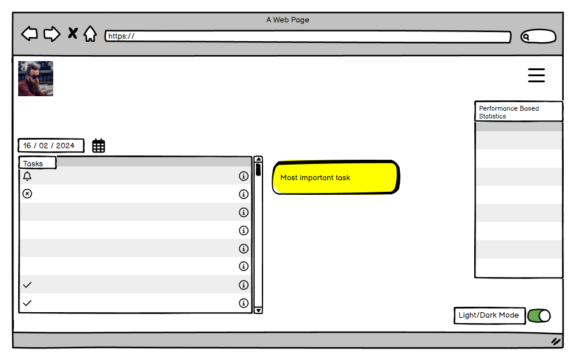
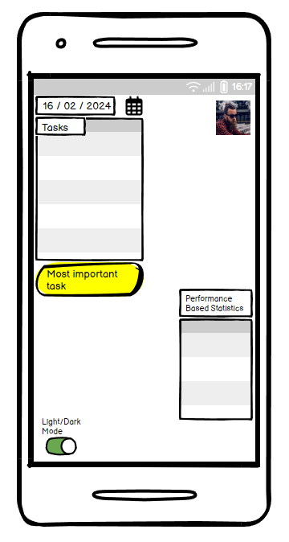
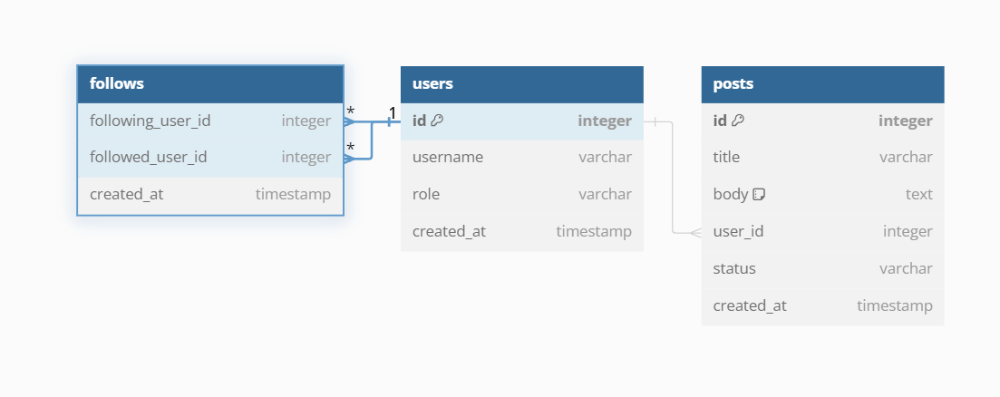
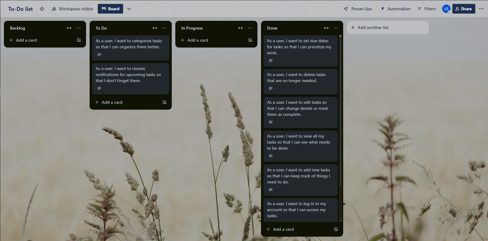

# To-Do List Application

## Overview

The To-Do List application is a full-stack web application built using the Django framework. It allows users to create, manage, and track their daily tasks. The application implements user authentication, including registration, login, and role-based permissions. Users can add, edit, delete, and mark tasks as complete. The app is responsive and designed with a user-friendly interface that adheres to accessibility guidelines and UX principles.

## Table of Contents

1. [Project Purpose](#project-purpose)
2. [Features](#features)
3. [UX Design](#ux-design)
4. [Data Model](#data-model)
5. [Installation and Setup](#installation-and-setup)
6. [Deployment](#deployment)
7. [Testing](#testing)
8. [Technologies Used](#technologies-used)
9. [Security Considerations](#security-considerations)
10. [Future Enhancements](#future-enhancements)
11. [User Stories](#user-stories)
12. [Challenges & Solutions](#challenges--solutions)
13. [Acknowledgements](#acknowledgements)
14. [License](#license)

## Project Purpose

The purpose of this project is to develop a responsive and accessible to-do list application where users can:
- Create, update, and delete tasks.
- Track task completion.
- Manage tasks using a profile with an editable profile picture and display name.
- Access the application via secure role-based authentication.

This project demonstrates the full-stack development of a web application using Django, and follows the principles of good UX design, security practices, and data handling.

## Features

- **User Registration & Login**: Users can sign up, log in, and log out securely. Passwords are hashed, and sensitive data is stored securely.

- **Task Management**: Users can add, edit, delete, and mark tasks as complete. Each task includes a title, description, date, and time.

- **Profile Management**: Users can update their profile picture and display name, which is shown on the task page next to their profile picture.

- **Username/Display Name Display**: The app dynamically displays either the user's username or their display name (if set) in the task list header.

- **Calendar Integration**: Tasks are displayed on a calendar view, allowing users to visualize their tasks by date.

- **Holiday Integration**: The app fetches holidays via an external API and displays them on the task calendar.

- **Responsive Design**: The application is fully responsive and accessible, ensuring a good user experience across all devices.

## UX Design

### Target Audience
- Busy individuals looking for a simple tool to organize and manage their daily tasks.
- Users who value a streamlined, no-nonsense interface with minimal distractions.

### Wireframes and Design Decisions

The application's design is based on the principles of good UX:
- **Information Hierarchy**: Tasks and controls are clearly organized for ease of use. Priority tasks are emphasized.
- **User Control**: All user interactions provide immediate feedback. For example, when tasks are completed, the user receives confirmation.
- **Accessibility**: The design follows accessibility guidelines, ensuring proper color contrast, keyboard navigability, and screen reader compatibility.

### Mockups
Mockups for each page of the application, including:
1. **Home Page** - Displays tasks and allows interaction (edit, delete, complete).
2. **Profile Page** - Allows users to update their profile picture and display name.
3. **Task Calendar** - Visualizes tasks on a calendar interface.

### Wireframes

Here are some wireframes representing the design of the application for desktop and mobile views:

1. **Desktop Wireframe**
   
   

2. **Mobile Wireframe**
   
   

## Database Schema and Relationships

The database schema consists of three primary relationships:
1. **User - Profile**: A one-to-one relationship where each `User` has one `Profile`. The `Profile` stores additional information like the profile picture, display name, and username.
2. **User - Task**: A one-to-many relationship where each `User` can have many `Tasks`, but each `Task` belongs to only one `User`.

### ERD (Entity-Relationship Diagram)

The following ERD diagram illustrates the relationships between the main entities in the database schema. It shows the `User`, `Profile`, and `Task` tables, and the relationships between them.



- **User - Profile**: There is a one-to-one relationship between the `User` and `Profile` tables. Each user has exactly one profile.
- **User - Task**: There is a one-to-many relationship between the `User` and `Task` tables. Each user can have multiple tasks, but each task is associated with only one user.

This schema is designed to manage users' tasks efficiently, ensuring that each user can maintain their own profile and manage multiple tasks seamlessly.

## Installation and Setup

### Prerequisites
- Python 3.x
- Django 4.x
- Git

### Installation Steps

1. **Clone the Repository**:
   ```bash
   git clone https://github.com/yourusername/todo-list.git
   cd todo-list

2. **Install Dependencies**:
   ```bash
   pip install -r requirements.txt

3. **Apply Migrations**:
   ```bash
   python manage.py migrate

4. **Create Superuser (for admin access)**:
   ```bash
   python manage.py createsuperuser

5. **Run the Server**:
   ```bash
   python manage.py runserver      

## Deployment

This application is deployed on Heroku, a cloud-based platform ideal for deploying full-stack applications. Below are the steps taken to deploy the project, including the necessary commands and configurations. These steps can be used by anyone looking to replicate the deployment process.

### Prerequisites

- Ensure you have a Heroku account and the Heroku CLI installed.

- Set up a PostgreSQL database (e.g., with Heroku Postgres or another managed database 
  provider) since this project uses PostgreSQL in production.

### Step-by-Step Deployment Guide

1. ***Create a New Heroku App***:

   ```bash
   heroku create <your-app-name>
-This command initializes a new Heroku app and sets up a remote Git repository that 
 points to Heroku.

2. ***Set Up Environment Variables***:
- In Heroku, navigate to your app dashboard.
- Under "Settings," click on "Reveal Config Vars."
- Add the following environment variables:

  - `DATABASE_URL`: The URL of your PostgreSQL database.

  - `SECRET_KEY`: A unique Django secret key.
  - Any other sensitive variables from `env.py`, such as API keys for third-party services.


3. ***Prepare the Application for Deployment***:
- Make sure the `Procfile` is set up with:

   ```plaintext
   web: gunicorn <your_project_name>.wsgi
- Ensure `requirements.txt` includes `gunicorn` for running the app in a production environment.  

4. ***Update Django Settings for Production***:
- Set `DEBUG = False` in your `settings.py` to prevent detailed error messages in production.
- Allow Heroku's domain in `ALLOWED_HOSTS`:

   ```python
   ALLOWED_HOSTS = ['<your-app-name>.herokuapp.com']
5. ***Deploy to Heroku***:
- Commit any final changes:
   ```bash
   git add .
   git commit -m "Prepare for Heroku deployment"
- Push to Heroku:
   ```bash
   git push heroku main
6. ***Run Database Migrations***:
- Once deployed, run the following commands to apply database migrations on Heroku:
   ```bash
   heroku run python manage.py migrate
7. ***Collect Static Files***:
- Run the `collectstatic` command to gather static files for production:
   ```bash
   heroku run python manage.py collectstatic --noinput
8. ***Open the Application***:
- After deployment is complete, you can open your app with:
   ```bash
   heroku open
**Testing deployment**

After deploying, verify that the production app behaves as expected by testing all features, such as task management, profile updates, and calendar functionality. Ensure there are no debug messages visible in production, and that all sensitive information is secure.

## Testing

#### Testing for this project involved:

- **Unit Tests**: Unit testing was conducted for individual components and features within the application. These tests primarily focused on verifying the correct behavior of key functions and methods. Examples include task creation (ensuring that tasks are created with the correct attributes such as title, date, and time), task completion (verifying that the task status updates correctly upon marking it as complete), and profile updates (checking that the user can successfully update their profile picture and display name). These tests helped isolate bugs early by ensuring each component worked as intended independently of the others.

- **Integration Tests**: Integration tests were implemented to ensure that various components of the application functioned together seamlessly. For instance, tests were written to verify the proper interaction between the task management system and the calendar integration. These tests confirmed that task data could be correctly serialized, passed to the calendar, and displayed in the appropriate slots based on date. Similarly, the interaction between the profile management system and the task list header was tested to ensure that display names and profile pictures were reflected in real-time upon update. These integration tests helped to catch any issues arising from the interaction between different parts of the system.

- **Manual Testing**: Manual testing was extensively performed to ensure the application's responsiveness and smooth user interactions across a variety of devices and browsers. This included testing for correct layout and functionality on desktop, tablet, and mobile devices, ensuring that the app maintains an optimal user experience on screens of all sizes. Manual testing also focused on interactions such as form submissions, navigation, task editing, and profile management, verifying that users received appropriate feedback for every action. Additionally, edge cases were tested manually, such as handling incorrect form inputs and user navigation to non-existent pages, to ensure the app handles errors gracefully. This manual testing ensured the application adhered to modern UX principles and accessibility standards.


## Technologies Used
**Frontend**:
- HTML5

- CSS3

- Bootstrap 5

**Backtend**:
- Python

- Django

**Database**:
- SQLite (for development)

- PostgreSQL (for production)

**Other Technologies**:
- Cloudinary (for profile picture storage)

- FullCalendar.js (for calendar integration)

- JavaScript (for handling dynamic interactions)

**Version Control**:
- Git

## Security Considerations
- **CSRF Protection**: Implemented via Django's built-in CSRF tokens.

- **Password Hashing**: Django’s authentication system securely hashes passwords.

- **Data Validation**: Forms are validated on both the client and server sides to prevent malicious input.

## Future Enhancements
- **Performance-Based Statistics**: Users can see insights and statistics based on their task completion performance.

- **Light/Dark Mode Toggle**: Users can switch between light and dark modes for better readability based on their preferences.

- **Push Notifications**: Implement push notifications to remind users of their tasks.

- **Task Categorization**: Allow users to categorize tasks with labels like "Work", "Personal", etc.

- **Task Prioritization**: Implement a priority feature to order tasks based on urgency.

- **Collaboration Features**: Add the ability for users to share tasks with others or collaborate on group projects.

## Agile Methodology and Project Management

**User Stories**

To effectively manage the development of this project, I chose to use Trello as my Agile project management tool. Trello allowed me to organize user stories, track tasks, and manage the workflow efficiently through different stages of development, from "To Do" to "Done." Below is a screenshot of my Trello board, demonstrating how I planned and executed the project using Agile practices.

[Trello Board](https://trello.com/invite/b/66adefdd1707236be0e94b4d/ATTI24b3f9b97614f96cd95dbadc9b8a0d3dFD3C2BF6/to-do-list)



## Challenges & Solutions

- **User Authentication**: Implementing secure user authentication and role management was a challenge. This was solved by using Django’s built-in authentication system and customizing it for the project.


- **Responsive Design**: Ensuring that the application worked seamlessly on all screen sizes required careful testing and media queries. Bootstrap was instrumental in helping achieve this.


- **Calendar Integration**: Integrating FullCalendar.js with Django to display tasks required converting task data to a JSON format. This was solved by using Django’s DjangoJSONEncoder to serialize the task data properly.


## Acknowledgements

- **Django Documentation**: For providing excellent resources on building full-stack applications.

- **Bootstrap**: For offering a responsive framework that made UI design easier.

- **FullCalendar.js**: For providing a robust calendar integration.

- **ChatGPT**: for providing valuable insights, coding assistance, and answering technical queries throughout the development process. Its guidance was instrumental in overcoming challenges and enhancing the functionality of the application.


## License
The MIT License (MIT)
Copyright © 2024 Lew-F Dev

Permission is hereby granted, free of charge, to any person obtaining a copy of this software and associated documentation files (the “Software”), to deal in the Software without restriction, including without limitation the rights to use, copy, modify, merge, publish, distribute, sublicense, and/or sell copies of the Software, and to permit persons to whom the Software is furnished to do so, subject to the following conditions:

The above copyright notice and this permission notice shall be included in all copies or substantial portions of the Software.

THE SOFTWARE IS PROVIDED “AS IS”, WITHOUT WARRANTY OF ANY KIND, EXPRESS OR IMPLIED, INCLUDING BUT NOT LIMITED TO THE WARRANTIES OF MERCHANTABILITY, FITNESS FOR A PARTICULAR PURPOSE AND NONINFRINGEMENT. IN NO EVENT SHALL THE AUTHORS OR COPYRIGHT HOLDERS BE LIABLE FOR ANY CLAIM, DAMAGES OR OTHER LIABILITY, WHETHER IN AN ACTION OF CONTRACT, TORT OR OTHERWISE, ARISING FROM, OUT OF OR IN CONNECTION WITH THE SOFTWARE OR THE USE OR OTHER DEALINGS IN THE SOFTWARE.